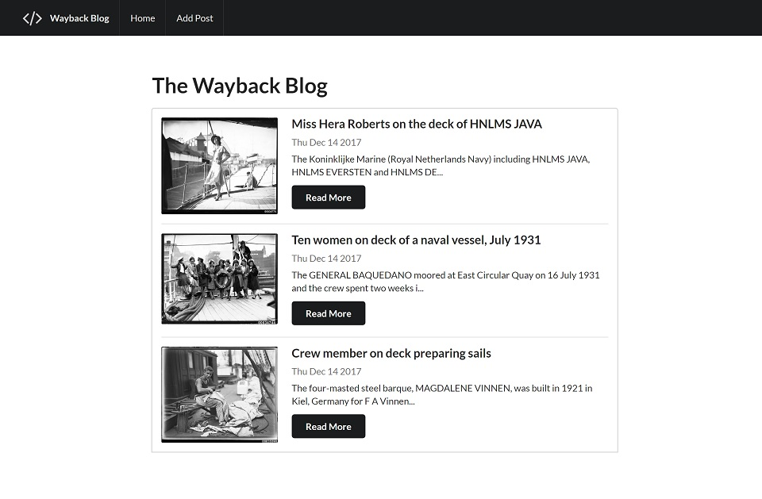

# RESTful Blog App

### Description & Motivation

This was my first introduction to Node.js, Express and MongoDB and project #04 on [Colt Steele's Web Development Bootcamp](https://www.udemy.com/the-web-developer-bootcamp).

Instead of styling the blog from scratch, I used Semantic UI for layout and styles. It was refreshing to use something different from Bootstrap and at the same time, I gained a better understanding about how CSS frameworks like this work and feel much more confident now using both Semantic and Bootstrap.

Because the framework's classes did all the heavy work, I was free to focus on the logic behind Node, Mongo and Express. A game-changer to me was learning how to convert HTML files to EJS templates and use JavaScript logic to dynamically display content.

I did not deploy this blog online, and instead have it running locally only.

### Tech/framework used

Made with love and:

* Semantic UI
* Node.js
* Express
* MongoDB

