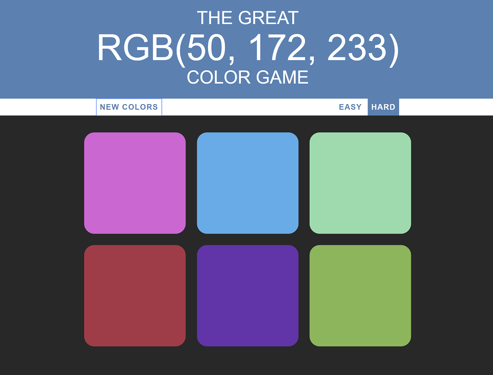

# Color Guessing Game

### Description & Motivation

This project is a code-along Color Guessing Game, part of [Colt Steele's Web Development Bootcamp](https://www.udemy.com/the-web-developer-bootcamp). On this project I practiced a lot of DOM manipulation, using vanilla JavaScript. The game involved generating a random RGB color, displaying color blocks with random colors and clicking to guess which of the blocks has the right RGB color. The game also has two modes, Easy and Hard -- each displaying a different number of color blocks.

At this point I know HTML and CSS quite well, but still need someone holding my hand when it comes to JavaScript. The good news is my knowledge of JS is starting to solidify. During this project I have paused the video before each new coding block, and tried to code on my own, before continuing with the video to see what Colt would do. I feel confident I can now tackle a small project with simple functionality on my own.

### Tech/framework used
Made with love and:
* HTML
* CSS
* Vanilla JavaScript

