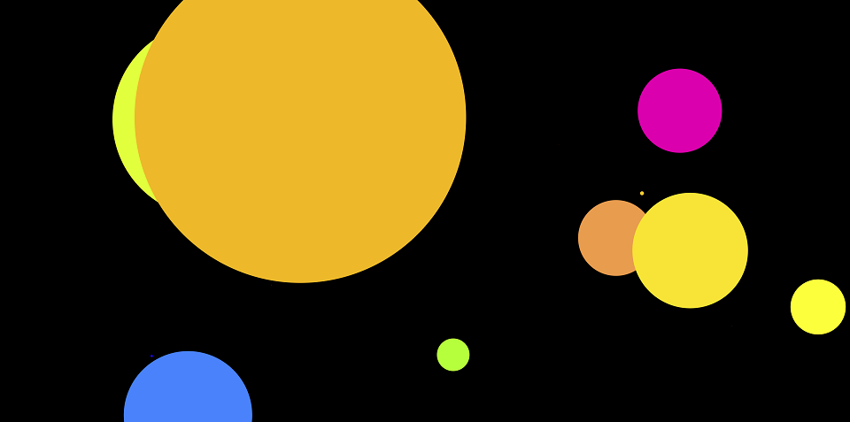

# Patatap

### Description & Motivation

This project is inspired on Patatap, and is part of [Colt Steele's Web Development Bootcamp](https://www.udemy.com/the-web-developer-bootcamp). On this project I practiced using two external frameworks, Paper-js to generate the animated circles, and Howler-js to reproduce sounds.

The project involved minimal CSS and HTML, and most of the heavy work was done by Paper-js framework. However, there was a lot of interesting logic involved in making each circle display in a random position on the canvas. I also learned how to map key events to specific colors and sounds and then make the circles respond to those events.

This was a really fun project to work on! The original Patatap is a much more complex project and can be found [here](https://patatap.com).

### Tech/framework used
Made with love and:
* HTML
* CSS
* JavaScript
* [Paper.js](http://paperjs.org)
* [Howler.js](https://howlerjs.com)

### Usage

Live Demo: [http://mindless-wool.surge.sh](http://mindless-wool.surge.sh)

