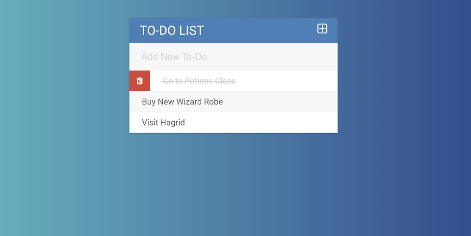

# To-Do List App

### Description & Motivation

This project is a code-along To-do List app, part of [Colt Steele's Web Development Bootcamp](https://www.udemy.com/the-web-developer-bootcamp). On this project I practiced a lot of DOM manipulation, using jQuery. I really like Colt's approach to first teach vanilla JavaScript and then jQuery. I can see jQuery is MUCH easier when it comes to the DOM, but I appreciate the fact I understand what it is doing.

To build this front-end app, I started building a simple HTML skeleton and then making sure the 3 pieces of JavaScript logic worked as intended: 1) adding a new todo and making sure it showed up on the list of todos; 2) checking/unchecking a todo as completed; 3) deleting todos. The final part of the project was the CSS styling, which involved CSS gradients and the use of font libraries.

This project definitely felt easier than the previous one (color game). Maybe the JS logic was simpler, or maybe I am starting to "get it". Either way, it feels it's time to try working on a personal project, to see how much I can build on my own.

### Tech/framework used
Made with love and:
* HTML
* CSS
* jQuery

### Usage

Live Demo: [bashful-fan.surge.sh](http://bashful-fan.surge.sh)

