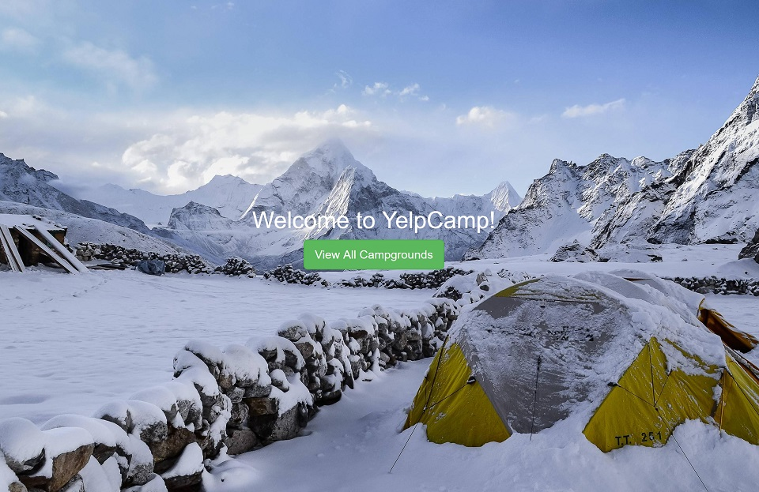

# YelpCamp

### Description & Motivation

This is the final project on [Colt Steele's Web Development Bootcamp](https://www.udemy.com/the-web-developer-bootcamp). Before I go into the details, I just want to say: I had _so much fun_ building YelpCamp!

I feel with YelpCamp I really started to see a real production web app is built. The project involved creating RESTful routes, making views with EJS templates, setting up local and production databases, seeding the local database, and even using Passport.js to create a login system.

I learned a lot of useful skills, but more importantly, I got to experience what a full stack developer does. I worked on both frontend and backend development, and I sincerely enjoyed doing both.

### Tech/framework used

Made with love and:

* Bootstrap v3
* Node.js
* Express
* MongoDB
* Passport.js

### V2

YelpCamp was a really fun project, that taught me many important skills. However, it has potential for more! I will keep working on **Version 2** and adding new extra features to make it prettier, safer and more robust.

Code repository: [https://github.com/mairamartinsk/yelp-camp](https://github.com/mairamartinsk/yelp-camp)

Live Demo: [https://ancient-ravine-82715.herokuapp.com/](https://ancient-ravine-82715.herokuapp.com/)

